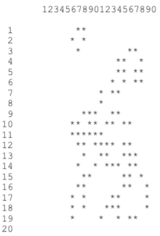

# 9.2-Game-of-Life

## **Background:** 

The “Game of Life” is a computer simulation of the life and death events of a population of bacterial organisms. This program will determine the life, death, and survival of bacteria from one generation to the next, assuming the starting grid of bacteria is considered generation zero. The rules for the creation of the next generation are as follows: 

1. A “neighbor” of a cell is defined as any cell touching that cell. For example, the eight blue cells in the diagram are the neighbors of the cell in the middle. 
 
2. Every empty cell with three living neighbors will come to life in the next generation (termed a “birth”). 
3. Any cell with one or zero neighbors will die of loneliness, while any cell with four or more neighbors will die from overcrowding (termed a “death”). 
4. Any cell with two or three neighbors will live into the next generation (no change). 
5. All births and deaths occur simultaneously. 

## **Assignment:**

1. Write a program that implements the game of Life. The size of the grid will be a square 20 x 20. 

2. After your program has initialized the grid with generation 0, your program must allow Life to 
proceed for 5 generations.

Generation 0:

4. Display the final results on the screen and determine the following statistical information: 

&nbsp;&nbsp;&nbsp;&nbsp;&nbsp;&nbsp;&nbsp;&nbsp;&nbsp;&nbsp;a. The number of living cells in row 10. 

&nbsp;&nbsp;&nbsp;&nbsp;&nbsp;&nbsp;&nbsp;&nbsp;&nbsp;&nbsp;b. The number of living cells in column 10. 

&nbsp;&nbsp;&nbsp;&nbsp;&nbsp;&nbsp;&nbsp;&nbsp;&nbsp;&nbsp;c. The number of living cells in the entire board. 

  
  
**Instructions: **

1. A sample run output is given below. Note, these are the correct answers if you use the String[][] grid.

 
&nbsp;&nbsp;&nbsp;&nbsp;&nbsp;&nbsp;&nbsp;&nbsp;&nbsp;&nbsp;Number in Row 10 ---> 8 

&nbsp;&nbsp;&nbsp;&nbsp;&nbsp;&nbsp;&nbsp;&nbsp;&nbsp;&nbsp;Number in Column 10 ---> 5 

&nbsp;&nbsp;&nbsp;&nbsp;&nbsp;&nbsp;&nbsp;&nbsp;&nbsp;&nbsp;Number of living organisms ---> 88 
  
  
